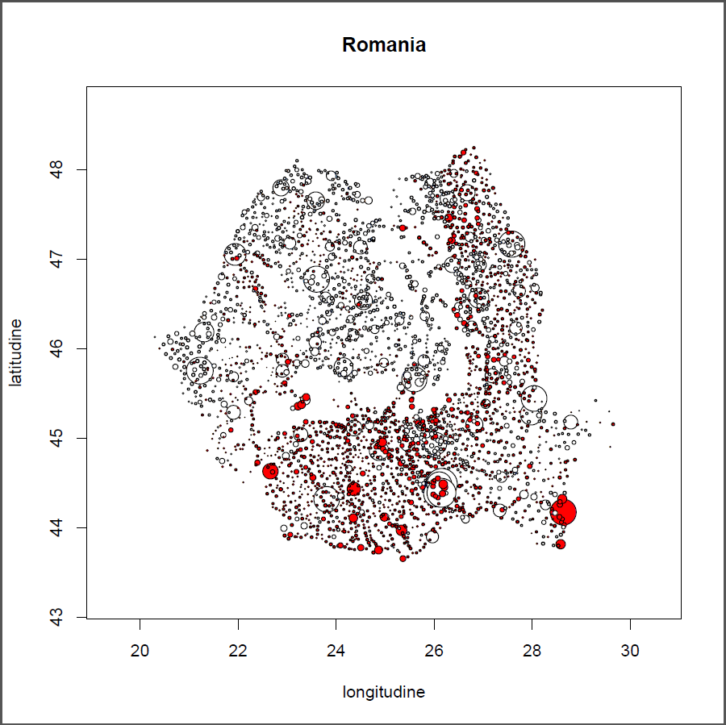
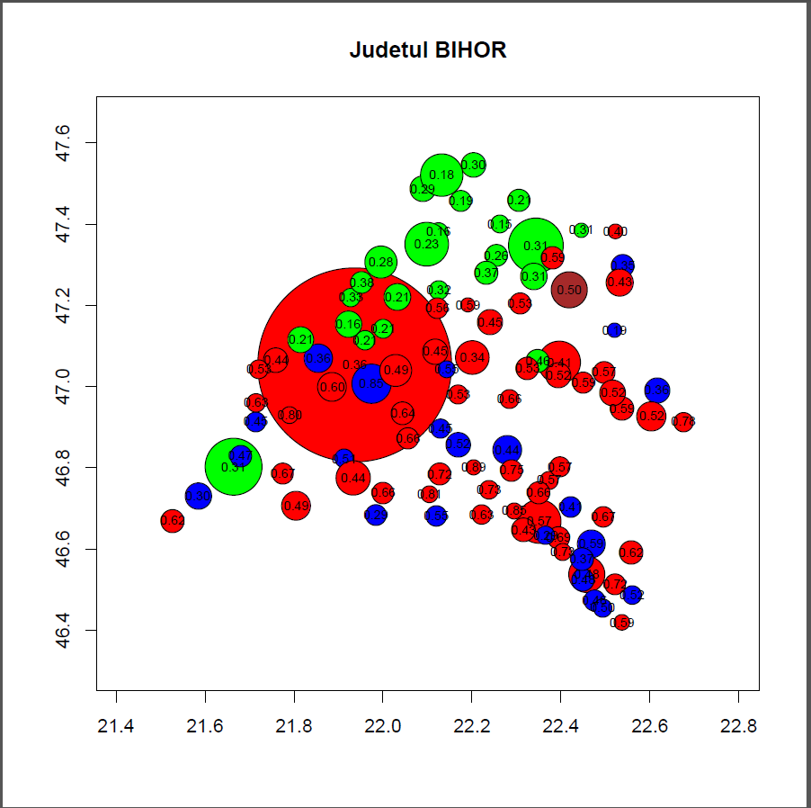
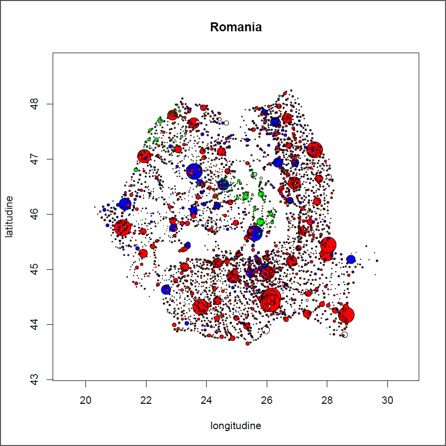
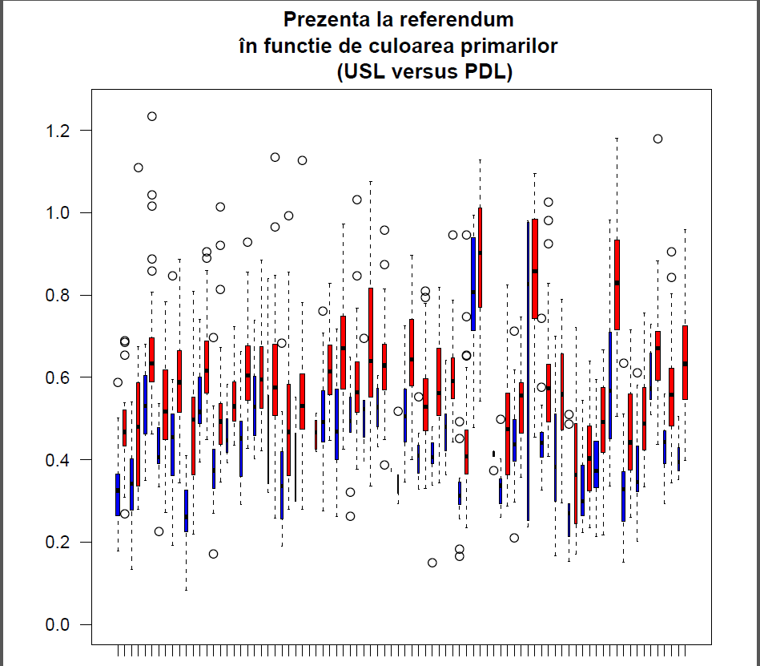
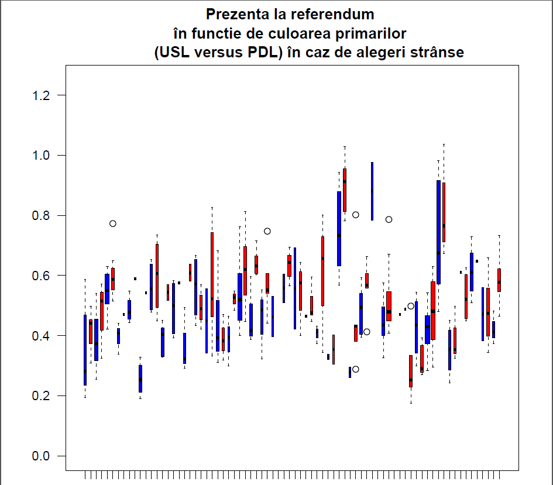
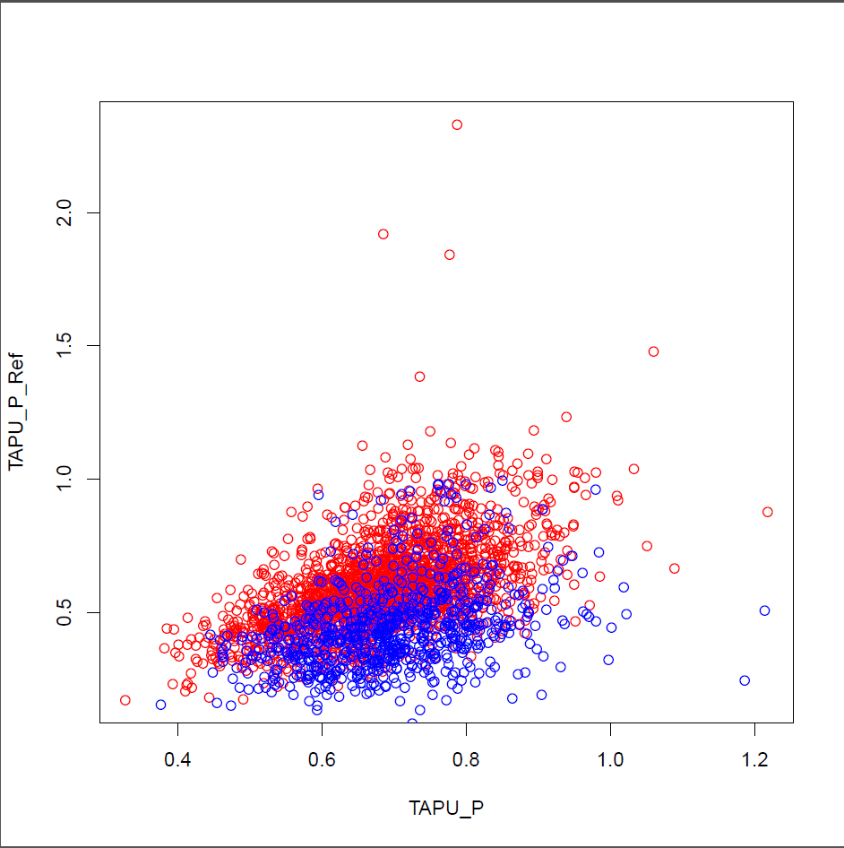

WARNING: CURRENTLY WORKING ON WINDOWS 10, BUT NOT ON UBUNTU 16.04, DUE TO ENCODING ISSUES

Some background on the 2012 Romanian elections 
---------------------------------

Local elections, June 2012. Details: https://ro.wikipedia.org/wiki/Alegeri_locale_%C3%AEn_Rom%C3%A2nia,_2012

Impeachment referendum, July 2012. Details: https://ro.wikipedia.org/wiki/Referendum_pentru_demiterea_pre%C8%99edintelui_Rom%C3%A2niei,_2012

General (Parliament) elections (two chambers), December 2012. Details: https://ro.wikipedia.org/wiki/Alegeri_legislative_%C3%AEn_Rom%C3%A2nia,_2012

Requirements
-----------------
> install.packages('R2HTML')

Data sources
---------------------------------
*Under construction*. Some details in parlElectionsReadme.txt (in Romanian)

Download and load the data
---------------------------------

If you don't feel like re-running most of the pre-processing phase, use **loadDump.R** (which was created by running **writeDump.R**). It will load the required objects into the memory.

To get the source data, run **getData.R**. This requires the package xlsReadWrite, unfortunately not available on CRAN anymore and probably incompatible with your R version. Therefore, you should rather use **loadDump.R**. 

**getData.R** requires **getGenElePrecinct.R** and **generalFunctions.R**.

Use the data (after the previous step)
---------------------------------

For **local elections**, load **localElections.R**. It requires **localFunctions.R**.

For **general (Parliament) elections**, run **parlElections.R**. It requires **parlFunctions.R**.

For the **referendum**, run **refElections.R**.

Work in progress
---------------------------------

**precComb...** files -> combining local, referendum and precinct data.

**chartsLocalRef** -> some charts using local elections and referendum data.

